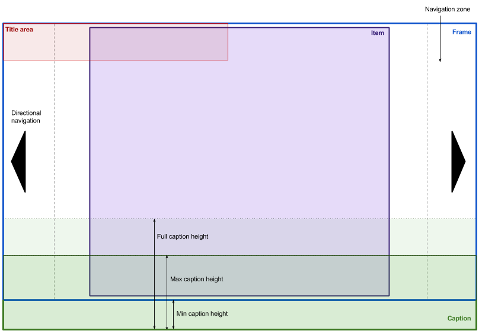

# Gallery

## Definitions

* **Item**: One of many objects to be displayed in the gallery.  Likely to be an image.  Must support being forcibly scaled to any size.
* **Frame**: A fixed element through which the items move
* **Page**: A set of items that may be displayed in the frame at the same time (for normal galleries, pages are likely to contain only one item, while thumbstrips will contain more than one)
* **Thumbstrip**: A gallery that has more than one item per page, and which is usually linked to another gallery to control it.

## UI

## Requirements

* **Size of frame**: Expand and contract as required to fit the exact dimensions of the parent element, less the reserved space at the bottom for any minimum height caption.
* **Size of item**: Items are displayed so they they are as large as possible whilst ensuring that both dimensions are inside the frame.
* **Previous/next nav**: Buttons overlaid on top of the image on the left and right edges, vertically centered.  On devices that support hover, buttons will appear briefly and then fade out, while on devices that do not support hover, they remain visible at all times.  Clicking or tapping on the button or anywhere in the navgiation zone (leftmost and rightmost 15% of the frame) will navigate to the next or previous item.
* **Captions**: Each item should support a caption, which is displayed at the bottom of the image, on a solid background below the frame, and if necessary partly on a translucent background on top of the image.  The caption area that extends below the frame must have a fixed height.
* **Touch**: The gallery should have the option to enable touch handling.  If touch handling is enabled, swiping should be supported to move to the next or previous page, snapping to page boundaries.
* **Sync**: It should be possible to join together multiple galleries so that when an item is selected in one, it is also selected and displayed in all the other galleries in the set (this enables thumbstrips to be used to navigate galleries)
* **Active item class**: A class should be used to mark the current item, and enable galleries to have a specific item as active on initalisation.
* **Invocation**: Must be possible to invoke the gallery by a) writing markup and adding classes or data attributes to prompt auto-discovery, b) writing markup and calling a JS API passing the containing element, and c) calling a JS API passing a containing element and a JSON array of items as HTML.
* **On demand loading**: If items are passed as JSON, the markup for the third and subsequent items should not be created in the DOM until the user iteracts with the gallery.
* **JavaScript API**: Each gallery should provide a JavaScript API as detailed below
* **Events**: Gallery must emit events as detailed below

### Out of scope

The following are out of scope for gallery, and recorded here as likely requirements for products which are not catered for internally by gallery:

* Maintaining an aspect ratio: The gallery will flex to the exact size of its parent, so the product must take responsibility for maintaining the aspect ratio of the container, if desired.

## Configurable options

* **Min caption height**: Minimum height of caption area, ie the amount reserved at the bottom of the gallery for a caption.  The frame should be reduced in height to allow this amount of space at the bottom of the containing element.
* **Max caption height**: Maximum height of caption before it is truncated.  User will be required to hover or touch the caption to allow it to expand beyond this height.
* **Enable/disable touch**: Whether to enable swiping (if true, will only be enabled on devices that support touch)
* **Multiple items per page**: Whether to allow multiple items per page (typically true only for thumbstrips)
* **Sync group ID**: Name of gallery group in which all galleries should sync up on the same image

## Events

The gallery should emit DOM events on its root element as follows:

* `ready`: The gallery has initialised and made all required DOM changes
* `itemChange`: The item in the gallery has changed.  Passes two arguments: the index of the newly active item, and what triggered the change ('user' or 'sync')

## JavaScript API

* `goto(idx)`: Navigates the gallery to the specified item index (starting from zero)
* `next()`: Navigates the gallery forward one item (or to the first item if currently on the last)
* `prev()`: Navigates the gallery backwards one item (or to the last item if currently on the last)
* `getCurrent()`: Returns the index of the current active item (integer)

## Markup

	

		TODO
	

