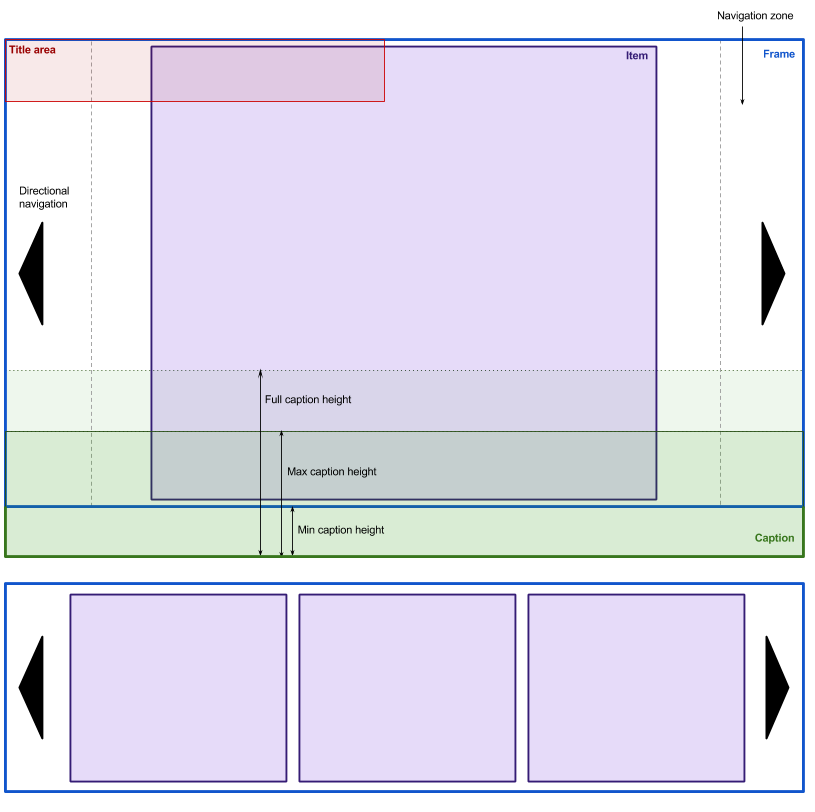

# o-gallery [](https://circleci.com/gh/Financial-Times/o-gallery)

A configurable content gallery. For carousels, slideshows and thumbnail strips.

## Definitions

* **Item**: One of many objects to be displayed in the gallery.  Likely to be an image.  Must support being forcibly scaled to any size.
* **Page**: A set of items that may be displayed in the frame at the same time (for normal slideshows, pages are likely to contain only one item, while thumbnail strips will contain more than one)
* **Viewport**: A fixed element through which the items move.
* **Shown**: only means _in view_.
* **Selected**: only means _chosen_.

A _shown_ item does not necessarily have to be _selected_, and vice versa.

The following wireframes show two example galleries: A) a gallery with single items per page, with a title and caption; B) a gallery with multiple items per page and no captions (ie, a thumbstrip). Galleries would often be used together in these forms to create a single coherent interface for viewing and navigating slideshows of images.



## Browser support

Gallery supports the same browsers as [FTScroller](https://github.com/ftlabs/ftscroller) (which it uses for touch/mouse input and transition behaviour), but also adds graceful degradation for IE8 and IE9.

In IE8 and IE9 there is no option for touch input support and there are no transitions (items & pages will change instantly). Usage of the [Polyfill service](https://polyfill.io/) is necessary in IE, and you need to request the default set of polyfills and, if you want it to work on IE8, also add the DOMContentLoaded one.

## Creating Galleries

Gallery content can come from either HTML already in the DOM, or data passed explicitly to Gallery javascript via a configuration object. See the _declarative_ demo for an example of the HTML structure required.

In both cases there must be an root element already in the DOM to construct the Gallery in. The root element must not be set to `display: none`, either directly or via an ancestor element, otherwise the Gallery will be unable to calculate its item widths and will not work correctly.

*Note*: a Gallery may behave oddly when an ancestor element is set to `display: table` causing issues with the Gallery sizing (see https://github.com/Financial-Times/o-gallery/issues/44 for more details).

Galleries can be constructed in three ways:

1. Declaratively from HTML source
2. Imperatively from HTML source
3. Imperatively from JS data

### 1. Declaratively from HTML source

With the HTML already in the page, the following method can be called to search for Gallery HTML elements and automatically construct a Gallery for each one:

	var galleries = Gallery.init();

Any gallery objects that are constructed will be returned.

Alternatively, a `o.DOMContentLoaded` event can be dispatched on the `document` to auto-construct a __o-gallery__ object for each element with a `data-o-component="o-gallery"` attribute:

```javascript
document.addEventListener("DOMContentLoaded", function() {
	document.dispatchEvent(new CustomEvent('o.DOMContentLoaded'));
});
```

Optionally, a DOM element can be passed to limit the search to a particular area of the page:

    var galleries = Gallery.init(document.getElementByClassName(".ft-article-body")[0]);

### 2. Imperatively from HTML source

With the HTML already in the page, a Gallery object can be constructed like so:

	var gallery1 = new Gallery(document.getElementById('#gallery1');

An optional configuration object can be passed as second argument:

	var gallery2 = new Gallery(document.getElementById('#gallery2', {
		// config options
	});

### 3. Imperatively from JS data

With just an HTML container element already in the page, a Gallery object can be constructed by passing the content as data via the config object:

	var gallery = new Gallery(document.getElementById('#gallery', {
		items: [ <itemObject>, <itemObject>, <itemObject> ...]
	});

Where an itemObject can consist of the following properties:

#### content

Type: `String` (required)

The HTML content of the item.

#### caption

Type: `String` (optional)

The HTML content of the item's caption.

#### selected

Type: `Boolean`

Default: `false`

Whether this item is selected. If more than one item is set to be selected, then only the first one will be selected.

For example:

	{
		content: '',
		caption: '<p>Slideshow caption text.</p>',
		selected: true
	}

## Configuration

Galleries can be configured by HTML data-attributes or the JS configuration object, or a combination of the two. Where both are supplied, the JS values will take precedence.

Once the config options have been gathered, the HTML data-attributes are added/updated to show the configuration actually in use.

### Multiple items per page

HTML source: attribute `data-o-gallery-multipleitemsperpage` on root element

JS property: `multipleItemsPerPage`

Type: `Boolean`

Default: `false`

Sets whether multiple items should be allowed to show per page. For example a normal slideshow would set this to `false`, but its thumbnail strip would set it to `true`.

### Sync ID

HTML source: attribute `data-o-gallery-syncid` on root element

JS property: `syncID`

Type: `String`

Default: `o-gallery-[timestamp]`

Sets the ID used in events fired and listened to by a Gallery instance. Setting two Gallery objects to the same sync ID will cause them to control each other - for example where Gallery 1 is a slideshow, and Gallery 2 is its thumbnail strip.

### Touch

HTML source: attribute `data-o-gallery-touch` on root element

JS property: `touch`

Type: `Boolean`

Default: `false`

Controls whether touch events will be listened to. See [ftscroller](https://github.com/ftlabs/ftscroller) for more details.

### Title

HTML source: Element inside container with a class of `o-gallery__title`.

JS property: `title`

Type: `String`

The [optional] Gallery title. Displayed in the top left of the viewport and remains in place for all items.

### Captions

HTML source: attribute `data-o-gallery-captions` on root element

JS property: `captions`

Type: `Boolean`

Default: `true`

Whether captions will be shown at all. With this set to true, a blank area will always be shown for every item, even if there is no caption data for an item.

### Caption min/max height

HTML source: attributes `data-o-gallery-captionminheight`, `data-o-gallery-captionmaxheight` on root element

JS property: `data-o-gallery-captionmaxheight`, `captionMaxHeight`

Type: `Integer`

Default: `24`, `52`

The height constraints of the caption area. The min value is used to position the caption area below the gallery item. If the content of the caption forces the caption height to increase, then it will increase upwards, in front of the gallery item, up to the maximum height set.

## Events

The following events will be dispatched on the Gallery's root DOM element:

* `oGallery.ready`: The Gallery has initialised and made all required DOM changes
* `oGallery.itemSelect`: The selected item in the gallery has changed. Passes two properties: the index of the newly active item, and the source of the change ('user' or 'api').
* `oGallery.scrollEnd`: A scroll has finished and passes the scrolling distance in the property `x`.

In IE8, these events will only be dispatched if the [EventTarget API](https://developer.mozilla.org/en/docs/Web/API/EventTarget) has been polyfilled.

## API

Note that _showing_ and _selecting_ are two separate concepts and are independent of each other.

There must always be one item selected, even if the _selected_ state is not made visible in the UI.

Each gallery _item_ has an index number. _Pages_ do not have index numbers as the number of pages can vary when a gallery has a variable width (e.g. in a responsive layout).

* `showItem(idx)`: Navigates the gallery to the specified item index (starting from zero)
* `showNextItem()`: Navigates the gallery forward one item
* `showPrevItem()`: Navigates the gallery backwards one item
* `showNextPage()`: Navigates the gallery forward one page
* `showPrevPage()`: Navigates the gallery backward one page
* `selectItem(idx, show)`: Selects item, and optionally shows it too.
* `selectNextItem(show)`: Selects next item, and optionally shows it too.
* `selectPrevItem(show)`: Selects previous item, and optionally shows it too.
* `getSelectedItem()`: Returns the index of the currently selected item (integer)
* `getSyncID()`: Returns the sync ID of that gallery
* `syncWith(galleryInstance)`: Sets the syncID to that of the gallery instance that's passed to the function
* `onResize()`: Resizes the gallery. This is executed when the viewport is resized. It should also be manually executed when the gallery is in a container element that's resized.

When a next/prev method is called, if there is no next or previous, then it will do nothing.

The desired behaviour of the left & right UI controls for single- and multiple-item-per-page galleries will be different. For example, in a slideshow (single item per page), the right arrow control should select _and_ show the next item, but in a thumbnail strip (multiple items per page), it should show the next page without affecting what it selected.

The following simplified methods are provided to handle this logic:

* `next()`:
	* multiple: false - `selectNextItem(true); // select & show`
	* multiple: true - `showNextPage(); // doesn't affect selection`
* `prev()`:
	* multiple: false - `selectPrevItem(true); // select & show`
	* multiple: true - `showPrevPage(); // doesn't affect selection`

These method may be useful for adding keyboard control to a Gallery.

## Sass

By default the Sass is in silent mode, meaning there will be no CSS output.

If you're `@import`ing the Sass into your product or component, and you want to turn off silent mode, then set the following Sass variable:

```scss
$o-gallery-is-silent: false;
```

If requesting the CSS from the build service, silent mode will automatically be switched off.

In silent mode, instead of the CSS classes listed below, use the [mixins documented here](sassdoc.webservices.ft.com/v1/sassdoc/o-gallery).

## Themes

By default, _Gallery_ only provides the minimum styling for a Gallery to be functional - e.g. mostly just positioning, and the previous/next UI controls.

Two themes are provided: for slideshows and thumbnails.

To use the slideshow theme, set a 'o-gallery--slideshow' class on the root Gallery element:

```html
<div class="o-gallery o-gallery--slideshow" data-o-component="o-gallery">
```

To use the thumbnails theme, set a `o-gallery--thumbnails` class on the Gallery root element:

```html
<div class="o-gallery o-gallery--thumbnails" data-o-component="o-gallery">
```

If creating your own theme, see the [Origami section on themes](http://origami.ft.com/docs/component-spec/modules/#themes).

The following Gallery classes are applied to elements in the Gallery structure:

* `o-gallery`: the Gallery's root element
* `o-gallery__viewport`: the are through which the Gallery items scroll
* `o-gallery__items`: the container of all the Gallery items
* `o-gallery__item`: the container of each item in the Gallery
* `o-gallery__item__content`: the container of an item's content
* `o-gallery__item__caption`: the container of an item's caption (if present)

In addition to this, a `aria-selected="true"` attribute is set on the _selected_ Gallery item. It is up to a product to use this attribute to apply styles as required. This class is only likely to be useful when `multipleItemsPerPage` is set to true. This class is also used to identify the initially selected item when constructing a Gallery from HTML source.

Themes must only be used with the default `o-gallery` classes.

### Hover styles

Gallery uses `:hover` styles. These can be enabled by products adding the `o-hoverable-on` class to the document body.

----

## License

Copyright (c) 2016 Financial Times Ltd. All rights reserved.

This software is published under the [MIT licence](http://opensource.org/licenses/MIT).
